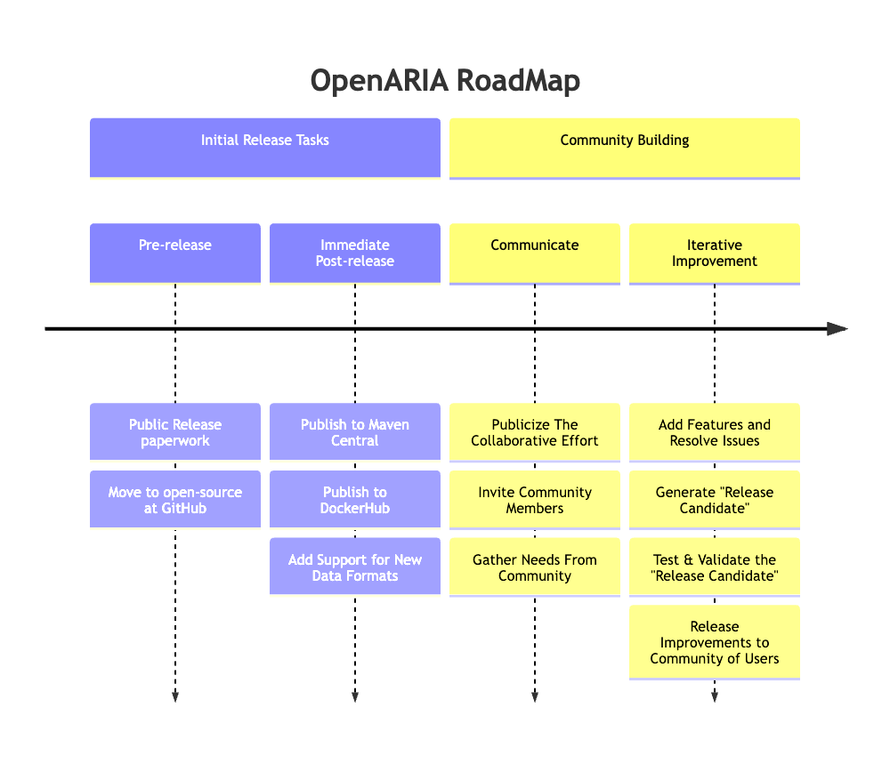

# Welcome to OpenARIA

This repository contains an open-source edition of the _Aviation Risk Identification and Assessment_ (ARIA) software
program developed by MITRE on behalf of the Federal Aviation Administration's (FAA) Safety and Technical Training (AJI)
Service Unit.

## OpenARIA's Goal

Our goal is to build a community focused on improving aviation safety & efficiency by extracting value from aircraft
location data.

## How OpenARIA can achieve this Goal

1. Provide a publicly available solution for **detecting aviation risks** within aircraft location data.
    - This tangible working solution can be critiqued by the community and improved as necessary.

2. Provide a publicly available solution for detecting **and then aggregating** aviation risks for bulk
   analysis.
    - Someone operating `OpenARIA` for a day will have one day's worth of output
    - Someone operating `OpenARIA` for a year will have a year's worth of output. 
    - We must facilitate capturing and utilizing large amounts of output data.

3. Provide a publicly available solution for **archiving and replaying** aircraft location data
   - E.g., when `OpenARIA` detects _an event_, we will want to be able to replay the event to understand what happened.

4. Provide solutions that work with near-real time data streams as well as archival data.

---

# Getting Started

- Learn about the supported data formats [here](./docs/csv-data-format.md)
    - **Important Caveat:** The initial code commit includes a dependency that is not available in the open source domain.
    - We are working to remove this blocker by:
      1. Proposing [this](./docs/csv-data-format.md) data format (which will replace the legacy format)
      2. Adding support for this new data format
      3. Refactoring the code so the closed-source dependency is no longer used or required.
      4. Building the project using **only** GitHub Actions and publicly available dependencies   
    - You can view the progress of this work by browsing the branches of the project.
- To begin **detecting aviation events** see [here](./docs/how-to/detect-encounters.md)
- To begin **archiving and replaying** aircraft location data see [here](./docs/how-to/replay-encounters.md)
- To begin detecting **and then aggregating** aviation data see [here](./docs/how-to/aggregate-encounters.md)_

---

# Documentation

- [High-level source code summary](docs/codeIntro.md)

- **About ARIA's Airborne Event Data**
    - An example of this JSON output data is [here](open-aria-airborne/src/test/resources/scaryTrackOutput.json)
    - A PDF describing the output data is [here](open-aria-airborne/airborneDataSpec_v3.pdf)

- **Architectural Decision Records (ADRs)**
   - [Why YAML configs are preferable to Properties](docs/ADRs/yamlOverProperties.md)
   - [Critique of Point and Track interfaces](docs/pointInterfaceCritique.md)
   - [How to compute an event's uniqueId](docs/ADRs/computingUniqueId.md)

---

# Using and Contributing

First of all, **Welcome to the community!**

### Contributing as a User

- **Please submit feedback.**
- Do you have a technical question? If so, please ask. We are here to help. Your question could lead to improvements.
  User questions lead to improved documentation, understanding defects, and eventually code improvements the reach
  everyone in the community.
- Do you have a feature request? If so, please ask. We'll see what we can do given the development time we have
  available.

### Contributing as a Developer

- We will use GitHub's Issue tracking features when the project launches.
- Anyone interested in making technical contributions is welcomed to communicate with the dev team on GitHub. Feel free
  to submit issues, fix issues, and submit PRs.
- We may write a _"contributing guidelines"_ document in the future should the need arise. But for now, our focus will
  be on making high-quality, high-value improvements to the code (not policy documents).

---

# Near-Term Project RoadMap

### Version History & Release Notes

See [here](docs/version-release-notes.md)

### MITRE Public Release
- Content approved for public release via The MITRE Corporation's "Public Release System" (PRS)
- Reference:  `Public Release Case Number: 23-3623`

### Legal Statement

- **Copyright:** The contents of this project is copyright `The MITRE Corporation`. See details [here](COPYRIGHT.txt) .
- **Open Source License:** This project is released under the Apache License Version 2.0. See details [here](LICENSE).
