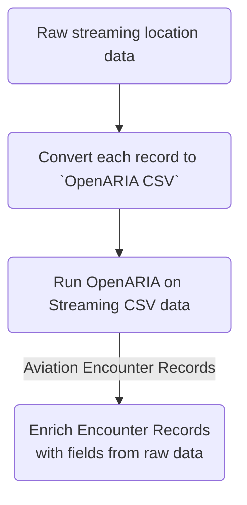

# OpenARIA's Default CSV Data Format

This document describes a simple CSV data format OpenARIA can use to ingest and process location data.

### Bottom Line Up Front

- OpenARIA can process aircraft & vehicle location data encoded in this CSV format:
    - `partition, subpartition, timestamp, vehicle_id, latitude, longitude, altitude, custom_1, custom_2, custom_3, ...`
    - Each row (or line) in a CSV file contains one piece of location data
    - The columns are described in more details below
- Users can avoid converting their location data into this CSV format **if** they are willing to develop the necessary
  data parser.
- The project intends to support additional formats in the future (when time and effort permit)
    - Adding support for ingesting [ASTERIX](https://en.wikipedia.org/wiki/ASTERIX) data is a high priority goal. The
      official ASTERIX spec can be found [here](https://www.eurocontrol.int/asterix).

## Why use Comma-Separated Values (CSV)

OpenARIA defines and supports receiving location data in CSV format for these reasons:

- **Language Agnostic:**
    - The OpenARIA project team wants to collaborate with as large of a community of users as possible.
      Consequently, we need a way to _"make data processable"_ without forcing someone to write a data parser in Java.
- **Human Readable:**
    - Data stored in CSV can be read by a human. Removing the overhead of data deserialization layer can
      sometimes speed up debugging.
    - Data stored in CSV can be edited by a human. Editing data is powerful and important because it enables creating
      unit tests that explore interesting corner cases (e.g., What happens when one altitude measurement is flawed? or
      What happens when a latitude/longitude location is incorrect?)
- **Approachability:**
    - The OpenARIA project team wants to easily on-board new users AND support mature production level use-cases.
      New users will likely benefit from working with this simple CSV data format. Sophisticated users may have the
      appetite, need, and knowledge to work with a different data format.
- **Byte Density:**
    - Data stored in CSV has _"medium byte density"_. CSV does not waste bytes by repeating variable names like JSON
      does. But it doesn't careful pack bytes like protobuf & avro do.
    - Additionally, CSV data is very amenable to standard data compression
      tools (e.g. `gzip` and `gzcat`)
- **Version Control & Unit Testing:**
    - Text based data is amenable to git.
    - Small CSV data samples can be kept in git and integrated into unit tests.
- **Lossless convertibility:**
    - **ANY** format of location data can be losslessly serialized to this CSV format and deserialized back to the
      original data format. [See how here](#converting-unknown-location-data-to-openaria-csv-format).

## CSV Format Column Definitions

| Column Num | Content             | Required | Comment                      |
|------------|---------------------|----------|------------------------------|
| 1          | Primary Partition   | False    | e.g. USA                     |
| 2          | Secondary Partition | False    | e.g. Texas                   |
| 3          | Timestamp           | True     | ISO 8601 format              |
| 4          | VIN or ID           | True     | Unique with data feed        |
| 5          | Latitude            | True     | -90.0 <= latitude <= 90      |
| 6          | Longitude           | True     | -180.0 <= longitude <= 180.0 |
| 7          | Altitude            | True     | In feet                      |
| 8          | Custom 1            | False    | Any variable you choose      |
| 9          | Custom 2            | False    | Any variable you choose      |
| ...        | ...                 | ...      | ...                          |
| N          | Custom N-7          | False    | Any variable you choose      |

### Column Details

1. **Unused** (by OpenARIA)**:**
    - OpenARIA **completely ignores this column**, but YOUR team and tooling may not.
    - This column is ignored by OpenARIA to give users the option to insert a field before the `timestamp` column.
    - This column could contain a data partition identifier like an airport code (e.g., `DFW`), airspace (e.g., `D10`
      or `ZFW`), or geohash (e.g., `9vfgp`)
2. **Unused** (by OpenARIA)**:**
    - OpenARIA **completely ignores this column**, but YOUR team and tooling may not.
    - This column is ignored by OpenARIA to give users the option to insert a field before the `timestamp` column.
    - This column could contain a data partition identifier like an airport code (e.g., `DFW`), airspace (e.g., `D10`
      or `ZFW`), or geohash (e.g., `9vfgp`)
3. **Timestamp - REQUIRED**
    - In [ISO 8601 format](https://en.wikipedia.org/wiki/ISO_8601)
    - E.g., `2024-02-06T19:36:37.664Z`
    - All times **must** be reported in Z-Time.
    - If the _Z_ does not appear at the end of a timestamp Zulu time will be assumed (**not local time!**).
    - How non-Z-time timestamps are handled is unspecified and subject to change.
4. **Unique Aircraft or Vehicle Identifier - REQUIRED**
    - This could be a globally unique ID like
      a [VIN number](https://en.wikipedia.org/wiki/Vehicle_identification_number) or a _"temporarily unique"_ ID number
      assigned be an aircraft surveillance system (e.g. aircraft #1 of 100)
5. **Latitude - REQUIRED**
    - We recommend reporting Latitude data to 4 decimal places of accuracy.
    - 3 decimal places yields a precision of `111m`
    - 4 decimal places yields a precision of `11.1m`
    - 5 decimal places yields a precision of `1.11m`
    - Using more than 5 digits of precision is probably a minor mistake because it exceeds the precision of the data
      source and wastes bytes in the CSV-file.
6. **Longitude - REQUIRED**
    - We recommend reporting Longitude data to 4 decimal places of accuracy.
    - 3 decimal places yields a precision of `111m`
    - 4 decimal places yields a precision of `11.1m`
    - 5 decimal places yields a precision of `1.11m`
    - Using more than 5 digits of precision is probably a minor mistake because it exceeds the precision of the data
      source and wastes bytes in the CSV-file.
7. **Altitude - REQUIRED**
    - In feet
8. **Optional Custom Field 1**
    - Any variable you want
9. **Optional Custom Field 2**
    - Any variable you want
10. **Optional Custom Field 3**
    - Any variable you want
11. **Continue adding columns to CSV as necessary ...**
    - Just continue adding CSV columns/variables until your data is fully converted.
    - Converting **any data stream** to this "OpenARIA CSV-format" can be a lossless conversion
    - If necessary, add the base64 encoded version of the original raw data (i.e. the non CSV source) to the last column

### Notice What Fields are Missing!

You might expect this CSV data format to require fields like `callsign`, `beacon code`, `speed`, `heading`,
and `climb-rate`. These fields are not required.

- _Aircraft label_ fields like `callsign` and `beacon code` are not required because:
    - Object location data is often missing these fields,
    - These fields can cause mistakes because they might "feel unique" but they will often be duplicated in real world
      data streams.
- _Aircraft physics_ fields like `speed`, `acceleration`, `heading`, `climb-rate`, `turn-rate` are not required because:
    - Object location data is often missing these fields
    - When these fields are included in location data they are often noisy and unreliable. For example, speed
      data is frequently inconsistent with time and location data.
    - OpenARIA chooses to deduce kinetic variables like speed, acceleration, and heading from time and location data.

### About these Columns

- **Columns 3, 4, 5, 6, & 7 are strictly required**
    - OpenARIA must have `Timestamp`, `Vehicle ID`, `Latitude`, `Longitude`, and `Altitude`
    - If any one of these fields is missing, the entire data point is invalid.
- **Columns 1, 2, and 8+ are optional and can be empty**
- Typically...
    - Columns 1 & 2 are reserved for _bulky fields_ like `airport`, `facility`, `region_id`, or `geohash`.
      These fields will help you split a large volume of data into smaller, more manageable fractions (e.g. the 5% of my
      data in the NYC region).
    - Columns 8+ are used for aircraft or vehicle specific fields
      like `callsign`, `beacon code`, `speed`, `position symbol`, `departure airport`, `arrival airport`, etc. These
      fields cannot be required by OpenARIA because some sources of location data do not include these fields. But! If
      your raw data has these fields we don't want the CSV-version of your data to lose this content. So simply appended
      them to the "end of the CSV"
- Columns 1, 2, and 8+ are not used by OpenARIA's "event detection" logic
    - **HOWEVER,** this data is included in any output record OpenARIA produces.
    - This means OpenARIA can perform its analysis, emit its output (which will include a copy of the input), and then
      we can mine the input for important meta-data (e.g., We can add `callsign` and `beacon code` to the output in a
      post-processing step)

---

## Sample CSV Data

In this section we provide a few examples of location data formatted according to this specification.

### Minimal Possible Specifications

- Here are 5 examples of the minimum possible CSV input:
    1. `,,2024-09-15T22:19:27.010,VIN_A,032.85676,-097.41115,35000,`
    2. `,,2024-09-15T22:19:27.101,VIN_B,033.63176,-097.18339,1800,`
    3. `,,2024-09-15T22:19:27.121,VIN_C,032.76422,-096.88218,11000,`
    4. `,,2024-09-15T22:19:27.121,VIN_D,033.24104,-097.09489,2500,`
    5. `,,2024-09-15T22:19:27.171,VIN_F,033.94250,-118.40800,2400,`
- These examples only include:
    - `Timestamp`, `Vehicle ID`, `Latitude`, `Longitude`, and `Altitude` (e.g. just the required fields).
- Notice:
    - The five example correspond to five different objects (we know this because 5th is different between all examples)
    - The CSV text begins with `,,` because the first two columns are empty

### Using Columns 1 and 2 to aide _"pre-OpenARIA"_ data handling

- Let's add `airport` and `geohash` to our 5 pieces of example data
- Here are the same 5 examples augmented with `airport` and a `geohash` that can helps us isolate pertinent data for
  processing
    1. `DFW,9vfdzm,2024-09-15T22:19:27.010,VIN_A,032.85676,-097.41115,35000,`
    2. `DFW,9vfzkd,2024-09-15T22:19:27.101,VIN_B,033.63176,-097.18339,1800,`
    3. `DFW,9vg47k,2024-09-15T22:19:27.121,VIN_C,032.76422,-096.88218,11000,`
    4. `DFW,9vfvne,2024-09-15T22:19:27.121,VIN_D,033.24104,-097.09489,2500,`
    5. `LAX,9q5c1e,2024-09-15T22:19:27.171,VIN_F,033.94250,-118.40800,2400,`
- These examples include:
    - `Airport`, `Geohash` (7-char precision), `Timestamp`, `Vehicle ID`, `Latitude`, `Longitude`, and `Altitude`
- The _Airport_ and _Geohash_ fields are completely ignored by OpenARIA (when using the default CSV format parser). But!
  Importantly, these fields are available in a source file so these fields can be used to filter down to just the data
  you want to process.
- Now that we added a leading `airport` field to the data it is trivial to filter down to just `LAX` or just `DFW` (
  using a simple `grep` or `awk` command)

### CSV data that uses columns 8 and 9

- Let's add `callsign` and `a complete copy of the raw data` to our 5 pieces of example data
- Here are the same 5 examples augmented with additional data that could be useful for a variety of context
    - `,,2024-09-15T22:19:27.010,VIN_A,032.85676,-097.41115,35000,AA123,base64-binary`
    - `,,2024-09-15T22:19:27.101,VIN_B,033.63176,-097.18339,1800,UAL456,base64-binary`
    - `,,2024-09-15T22:19:27.121,VIN_C,032.76422,-096.88218,11000,DLH789,base64-binary`
    - `,,2024-09-15T22:19:27.121,VIN_D,033.24104,-097.09489,2500,SWA123,base64-binary`
    - `,,2024-09-15T22:19:27.171,VIN_F,033.94250,-118.40800,2400,FDX456,base64-binary`
- These examples include:
    - `Timestamp`, `Vehicle ID`, `Latitude`, `Longitude`, `Altitude`, `Callsign`, and a `base64 encoded copy of raw`.

## Converting unknown location data to `OpenARIA CSV format`

- If you have aircraft location data that is not directly supported by Open ARIA
- Use this algorithm to convert arbitrary location data to the `OpenARIA CSV format`:
    1. For each item `LD` of location data
    2. Convert `LD` to a byte[] `byteArray`
    3. Encode the `byteArray` as a [Base64](https://en.wikipedia.org/wiki/Base64) String `LD_as_base64`
    4. Create a String like:
       ```
       String csvRecord = ",," + 
       LD.timestamp() + "," + 
       LD.vehicleId() + "," +
       LD.latitude() + "," + 
       LD.longitude() + "," + 
       LD.altitudeInFeet() + "," + 
       LD_as_base64;
       ``` 
    5. Emit the fully converted `csvRecord`.

## Potential Data Processing Flow

