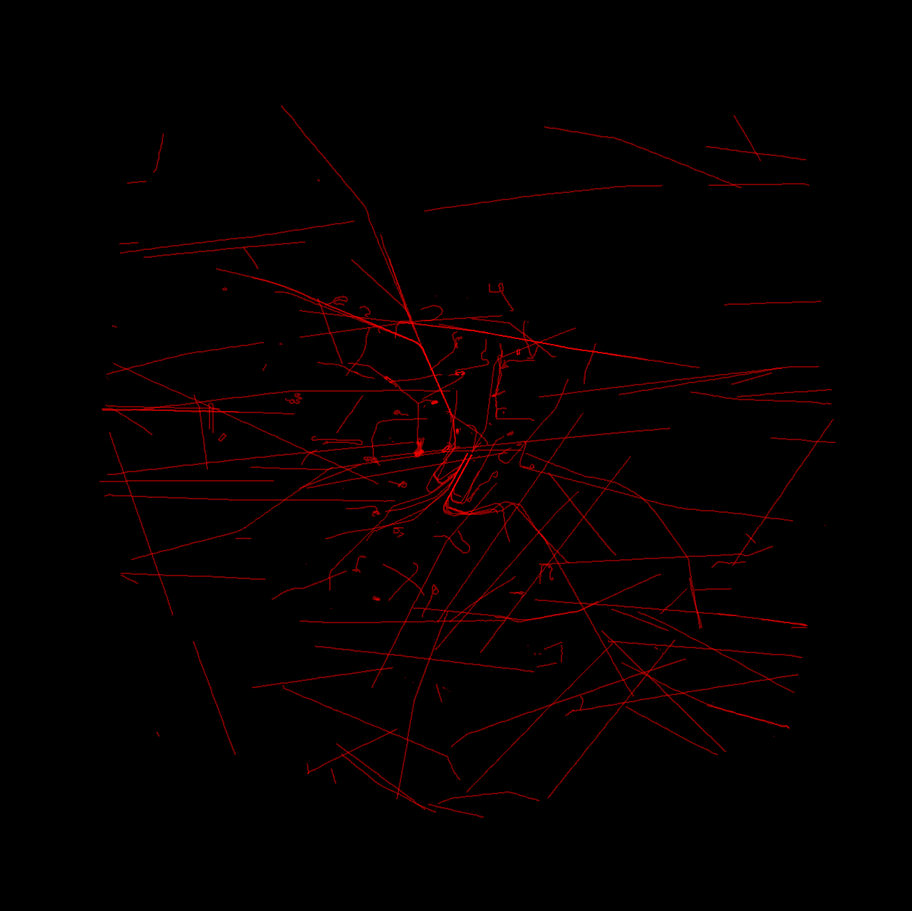
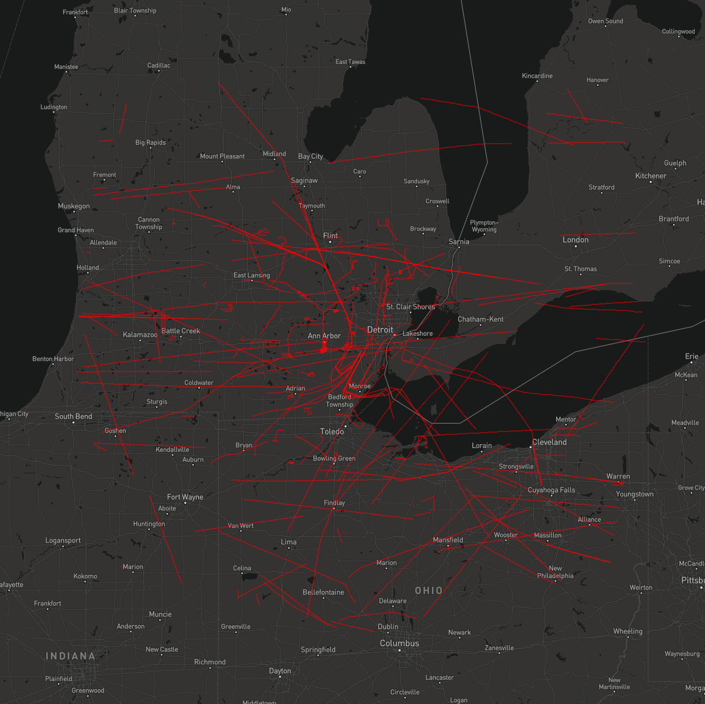
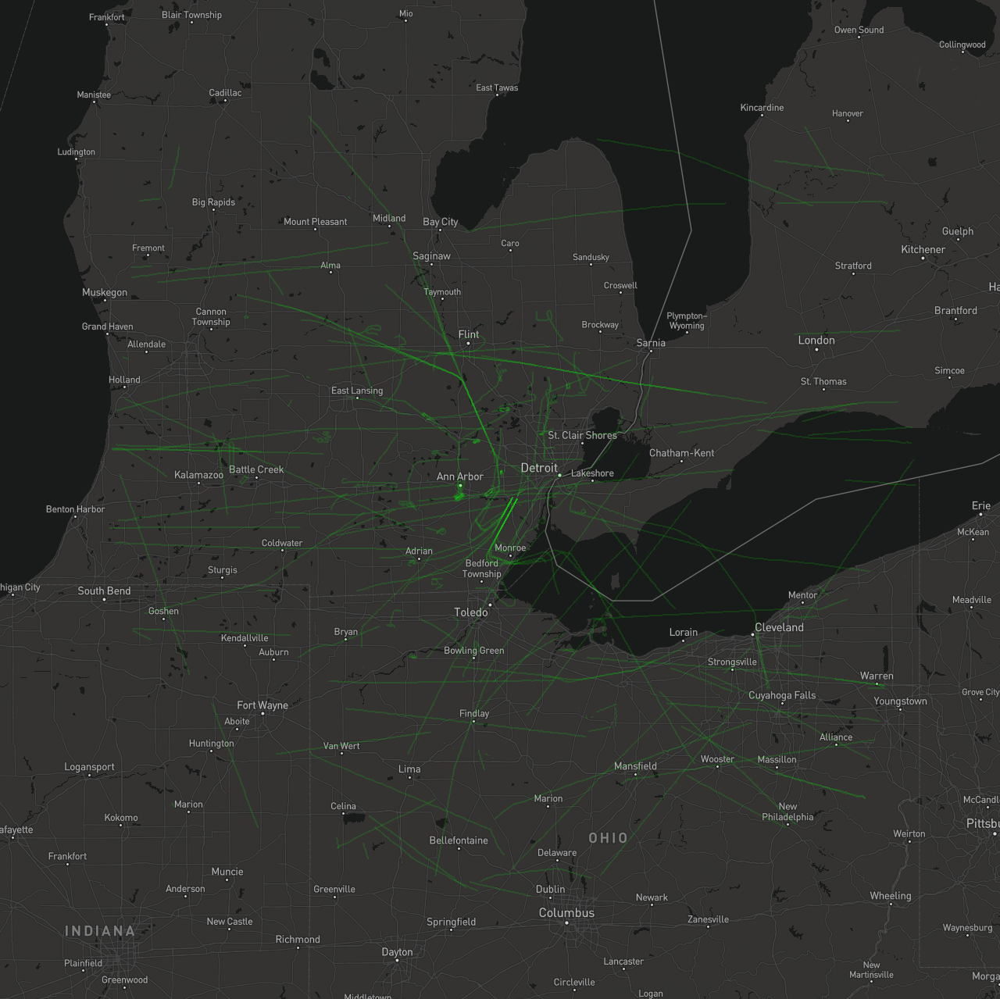

# How to use `OpenARIA` to Inspect a Dataset

---

## NOTICE: Docker-base tutorial coming soon!!

- A docker-base tutorial will be easier to use because it won't require users to install Java. In the revised tutorial
  you'll simply run `InspectDataset` on a file of location data.

---

## What you'll do

1. **Download:** `OpenARIA's` _uber-jar_ and a sample dataset.
2. **Run:** OpenARIA's `InspectDataset` program on the sample dataset.

## What you'll need

- A locally installed version of java (JDK 17+).

---

# Instructions

### Step 0: Verify your Java Install

- OpenARIA (currently) requires a local Java install.
- Run the command: `java --version` to verify your java installation.
- This command should produce something like:
    ```
   openjdk 17.0.6 2023-01-17
   OpenJDK Runtime Environment Temurin-17.0.6+10 (build 17.0.6+10)
   OpenJDK 64-Bit Server VM Temurin-17.0.6+10 (build 17.0.6+10, mixed mode)
    ```
- Java 17+ is required.
- If you don't have Java installed locally, download it from [here](https://adoptium.net/).

### Step 1: Download a recent `OpenARIA` compiled jar

- Navigate to: [OpenARIA's release page](https://github.com/mitre-public/open-aria/releases)
- Pick a recent release version (e.g. [0.2.0](https://github.com/mitre-public/open-aria/releases/tag/0.2.0))
- Download the compiled jar (e.g. `open-aria-0.2.0.jar`)
    - This jar contains all needed software assets (including 3rd-party dependencies!) gathered together in one _"
      uber-jar"_.

### Step 2: Download a sample dataset

- Download [sampleData.txt.gz](https://github.com/mitre-public/open-aria/blob/main/open-aria-airborne/src/test/resources/sampleData.txt.gz)
from the repo's directory of test assets.
- Use the "Download raw file" button in the upper right hand corner

- This file contains about 10 minutes of aircraft location data.

### Step 3: Co-locate the data and uber-jar

- Create a new directory.
- Copy the uber-jar into this directory.
- Copy the dataset into this directory.

### Step 4: Run the `InspectDataset` program

- Run: `java -cp open-aria-0.2.0.jar org.mitre.openaria.InspectDataset -f sampleData.txt.gz --nop`
- This command uses `InspectDataset` to describe the data found inside `sampleData.txt.gz`
- Its output will look like:
    ```
    == Histogram of Points per 60sec ==
    2018-03-24T14:55:00Z: 596
    2018-03-24T14:56:00Z: 1731
    2018-03-24T14:57:00Z: 1711
    2018-03-24T14:58:00Z: 1709
    2018-03-24T14:59:00Z: 1652
    2018-03-24T15:00:00Z: 1656
    2018-03-24T15:01:00Z: 1645
    2018-03-24T15:02:00Z: 1643
    2018-03-24T15:03:00Z: 1659
    2018-03-24T15:04:00Z: 1663
    2018-03-24T15:05:00Z: 1652
    2018-03-24T15:06:00Z: 1643
    2018-03-24T15:07:00Z: 1040
  
    == Statistics on Points per Track ==
    Num Tracks: 364
    Min Track Size: 1
    Avg Track Size: 54.57
    Max Track Size: 205
    StandardDev of Track Size: 58.88
  
    == Statistics on Track Duration ==
    Num Tracks: 364
    Min Track Duration: 0.0sec
    Avg Track Duration: 297.49sec
    Max Track Duration: 718.0sec
    StandardDev of Track Duration: 290.16
  
    == Statistics on Track Points Per Minute ==
    Num Tracks: 300
    Min Track Points Per Minute: 5.01
    Avg Track Points Per Minute: 11.89
    Max Track Points Per Minute: 120.00
    StandardDev of Points Per Minute: 8.10
  
    == Track start times ==
    2018-03-24T14:55:00Z: 161
    2018-03-24T14:56:00Z: 20
    2018-03-24T14:57:00Z: 18
    2018-03-24T14:58:00Z: 14
    2018-03-24T14:59:00Z: 9
    2018-03-24T15:00:00Z: 21
    2018-03-24T15:01:00Z: 12
    2018-03-24T15:02:00Z: 15
    2018-03-24T15:03:00Z: 19
    2018-03-24T15:04:00Z: 22
    2018-03-24T15:05:00Z: 21
    2018-03-24T15:06:00Z: 19
    2018-03-24T15:07:00Z: 13
  
    == Track end times ==
    2018-03-24T14:55:00Z: 5
    2018-03-24T14:56:00Z: 16
    2018-03-24T14:57:00Z: 23
    2018-03-24T14:58:00Z: 16
    2018-03-24T14:59:00Z: 10
    2018-03-24T15:00:00Z: 21
    2018-03-24T15:01:00Z: 12
    2018-03-24T15:02:00Z: 16
    2018-03-24T15:03:00Z: 20
    2018-03-24T15:04:00Z: 21
    2018-03-24T15:05:00Z: 22
    2018-03-24T15:06:00Z: 22
    2018-03-24T15:07:00Z: 160
  
    == Making Map of Input Data ==
    Map Created, see: map-of-sampleData.txt.png
    ```

### Run `InspectDataset` and generate a plain Map

- Add `--map` to the command, and you'll also get a plain map with a black background
- e.g. Run: `java -cp open-aria-0.2.0.jar org.mitre.openaria.InspectDataset -f sampleData.txt.gz --nop --map`
- The map looks like:
  

### Run `InspectDataset` and generate a properly titled Map

- Add `--map --mapBoxTiles` to the command, and you'll also get a map drawn on top of MapBox tiles
- e.g. Run:
  `java -cp open-aria-0.2.0.jar org.mitre.openaria.InspectDataset -f sampleData.txt.gz --nop --map --mapBoxTiles`
- Using the `--mapBoxTiles` flag requires an API token for the MapBox service.
- See: the "Map making" documentation in the MITRE Commons
  library [here](https://github.com/mitre-public/commons/blob/main/docs/mapping.md)
- The map looks like:
  

### Run `InspectDataset` and generate a custom Color & Alpha Map

- Add any combination of `--red {VALUE}`, `--green {VALUE}`, `--blue {VALUE}`, `--alpha {VALUE}` where VALUE is between
  0 and 255 (except alpha, it's minimum value is 1)
- Add `--zoomLevel {VALUE}` where VALUE is between 1 and 15
- e.g. Run:
  `java -cp open-aria-0.2.0.jar org.mitre.openaria.InspectDataset -f sampleData.txt.gz --nop --map --green 255 --alpha 35`
- The map looks like:
  