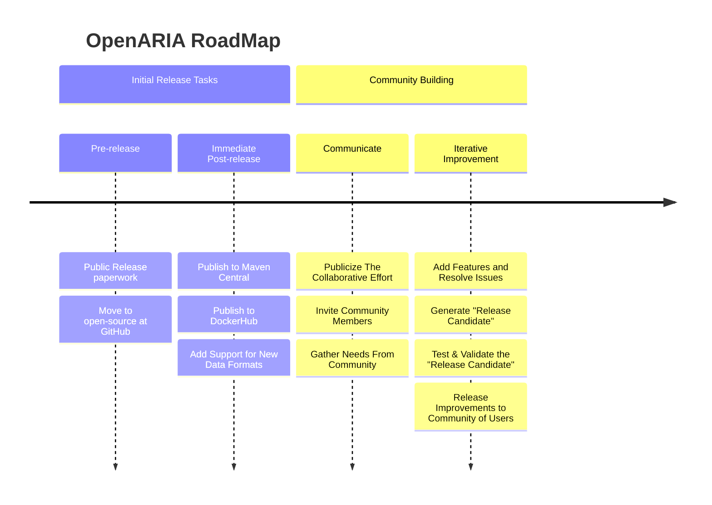

Paste this `mermaid text` into https://mermaid.live/ to get a nicely rendered image for our README.  (Not every site
supports mermaid, so we'll use an image)

[//]: # (available themes = default, neutral, dark, forest, base)

